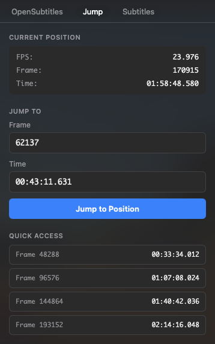

# Jump to Frame for IINA

Frame-accurate seeking plugin for [IINA media player](https://iina.io/).

## Features

- **Frame Status**: FPS, current frame number and timecode.
- **Smart Input**: Jump via frame number or flexible timecode formats.
- **Jump History**: Quick-access list of recent positions.

## Usage

Access the **Jump to Frame** sidebar in two ways:

- **Menu**: `Plugin` → `Jump...`
- **Keybind**: <kbd>⌘</kbd> + <kbd>G</kbd>

> [!TIP]
> Keybind can be modified or disabled via the plugin's **Preferences** tab

## Installation

**Requirement**: IINA 1.4.0 or later.

Install the plugin using one of these methods:

- **GitHub**: In **IINA Settings** → **Plugins**, click **Install from GitHub...** and enter `bbeny123/iina-jump-to-frame`
- **Manual**: Download the `.iinaplgz` file from the [latest release](../../releases)

## Alternative: Userscript

This plugin is an extended version of the original single-file userscript (see [userscript/README.md](userscript/README.md) for details).
